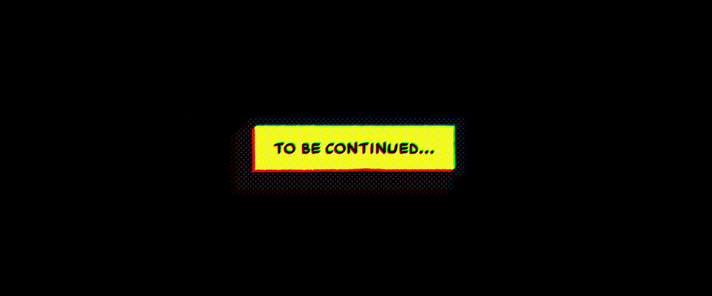

# **Spider-Man: Across the Spider-Verse** - Cảm nhận

Nhanh và ngắn gọn: Đây là **trải nghiệm điện ảnh đã nhất của cá nhân mình** tính đến thời điểm viết bài này. Không những thế phim này mình đi xem rạp tận 2 lần, và xem thêm $n$ lần nữa khi có bản đẹp. Sau đây là những cảm nhận của cá nhân mình về phim.

<!-- more -->

!!! note

    Trước khi đi vào phần chính, xin note một số ý:

    -   Mình bắt đầu đi xem phim rạp từ cuối năm 2019, các siêu phẩm trước đó như Infinity Wars, Endgame,... thì vì còn là sinh viên nên chỉ có xem trên phimmoi. Lời mở đầu không hề nói điêu, đây đúng là trải nghiệm xem phim rạp mà mình nhớ nhất.
    -   Mình không đọc comic nên không biết về sự kiện Spider-Verse trong comic và cũng không rành lắm về các biến thể Spidey (mấy biến thể nổi bật thì biết). Những cảm nhận của mình chỉ xuất phát từ phần phim này và các phim về Spider-Man trước đó (Spider-Man: Into the Spider-Verse, các phim Spider-Man của Tobey, Andrew và Tom).

!!! warning "Lưu ý"

    Đây chỉ là cảm nhận của con dân bình thường đi xem phim, không thể chuyên nghiệp như mấy ông chuyên review phim được. 

## 1. Kỳ vọng trước khi xem phim

Phải nói mình kỳ vọng rất cao trước khi đi xem phim này vì:

1.  Mình cũng là một fan của Spider-Man (who wouldn't? =)) )
2.  Mình rất thích phần phim trước Spider-Man: Into the Spider-Verse, đặc biệt là mặt nội dung và hình ảnh.

Do vậy, mình đi xem phần 2 này với kỳ vọng rất lớn: Kỳ vọng về câu chuyện sau khi Spider-Man 2099 được nhá hàng ở after credit của phần trước, kỳ vọng về trải nghiệm hình ảnh sau khi phần phim trước đã làm rất tốt, kỳ vọng về các biến thể Spider-Man mới,...

Và phim thậm chí còn vượt cả những kỳ vọng trên của mình.

## 2. Cảm nhận khi bước ra khỏi rạp

Vẫn nhớ cảm xúc đầu tiên ngay khi hết phim là kiểu "Ủa hết phim rồi à?".

Mình xem bị cuốn từ đầu đến cuối, phê cả về nội dung, âm thanh, hình ảnh của phim mà không cảm nhận được là đã xem được hơn 2 tiếng rồi. Phim kết thúc theo kiểu cliffhanger, thành ra cái lúc đấy mình nghĩ chắc mới được đâu đó 2/3 phim, xong nó hiện ra chữ TO BE CONTINUE. Má quả hết phim cay vđ =))

<figure markdown="span">
    
    <figcaption>Ủa hết phim rồi à?</figcaption>
</figure>

Có một nhận định trên mạng mà mình thấy cũng đúng là thế này:

!!! quote "Bấm tạm dừng bất kỳ lúc xem phim, đều nhận được một hình ảnh đẹp."

Một quyết định cực đúng đắn là mình chọn xem IMAX trong lần đầu xem phim. Hình ảnh của phim đẹp dã man, mình thấy đẹp hơn cả phần trước. Có quá nhiều cảnh để lại ấn tượng trong đầu mình khi bước ra khỏi rạp. Dưới đây chỉ là một vài trong số rất nhiều khoảnh khắc đấy.

<figure markdown="span">
    
    <figcaption>Cảnh màu nước thay đổi và loang ra theo cảm xúc của Gwen ấn tượng thật sự.</figcaption>
</figure>

<figure markdown="span">
    
    <figcaption>Rất thích khung hình này. Đi chơi với Crush đồ.</figcaption>
</figure>

<figure markdown="span">
    
    <figcaption>Cảnh này kiểu đẹp mà chill vãi. Lúc xem là biết ngay chắc chắn đây sẽ là hình nền laptop mới rồi.</figcaption>
</figure>

<figure markdown="span">
    
    <figcaption>Hình ảnh vẫn đẹp nhưng đẹp kiểu dark. </figcaption>
</figure>

Trải nghiệm âm thanh hôm đấy cũng rất đã. Lần đầu xem thì không biết tên soundtrack, chỉ nhớ những đoạn mà thấy âm thanh cực phê. Không chỉ thế bài end credit cũng hay nữa. 

!!! note "Fun fact"

    Spotify recap năm 2023 của mình thì mình nghe bài Am I Dreaming (end credit của phim) hơn 1200 lần, mà phim thì ra vào tháng 6/2023.

Sau khi đi xem về thì cũng bắt đầu tìm kiếm nhạc phim. Sau đây là danh sách OST mà mình thấy đã nhất lúc xem phim (thậm chí là đến giờ mình vẫn nghe đi nghe lại những soundtrack này):

-   [:fontawesome-brands-youtube: Falling Apart](https://youtu.be/EcnV0S4kyQQ) (từ đoạn 05:24 trở đi)
-   [:fontawesome-brands-youtube: The Anomaly ](https://youtu.be/Pr9gvxI5Ay0)
-   [:fontawesome-brands-youtube: Across the Spider-Verse (Start a Band)](https://youtu.be/DGwW4EHgV6o)
-   [:fontawesome-brands-youtube: Am I Dreaming](https://youtu.be/2xomWWncop0)

## 3. Một vài khoảnh khắc ấn tượng

Mục trên kia là những cảnh ấn tượng về mặt hình ảnh. Mục này sẽ là những chi tiết trong câu chuyện của phim để lại cảm xúc khi xem.

<figure markdown="span">
    
    <figcaption>Đoạn Gwen tiết lộ danh tính trước bố của mình là phân đoạn cảm xúc đầu tiên. (Và hình ảnh cũng đẹp vl. Theo mình thì Earth-65 của Gwen là vũ trụ có hình ảnh đẹp nhất phim)</figcaption>
</figure>

<figure markdown="span">
    
    <figcaption>Đội hình Spidey được người dân ở Earth-50101 tung hô cũng rất cảm xúc. Cảnh này càng có ý nghĩa hơn khi phần sau của phim tiết lộ hành động cứu người của Miles có thể huỷ diệt cả vũ trụ này. Nghĩa là mặc dù làm được việc tốt, được người dân tung hô, nhưng chưa chắc việc làm này đã là việc làm đúng.</figcaption>
</figure>

<figure markdown="span">
    
    <figcaption>Lần đầu tiên Spider Society xuất hiện. Một sự choáng ngợp.</figcaption>
</figure>

<figure markdown="span">
    
    <figcaption>Hình ảnh này chỉ là đại diện cho toàn bộ đoạn Miguel giải thích cho Miles về Spider verse và Cannon event. Những câu chuyện về các Spider-Man và những ký ức tuổi thơ khi những Spider-Man quen thuộc xuất hiện.</figcaption>
</figure>

<figure markdown="span">
    
    <figcaption>Đoạn này chắc không cần phải giải thích =)) Đi xem rạp 2 lần thì cả 2 lần nguyên rạp đều cười ồ lên cảnh này.</figcaption>
</figure>

<figure markdown="span">
    
    <figcaption>Khúc này bắt đầu căng thẳng khi mà Miles và người xem biết được sự thật về lý do thực sự tại sao Miles lại thành Spider-Man</figcaption>
</figure>

<figure markdown="span">
    
    <figcaption>Phân cảnh mình ấn tượng nhất phim. Nghĩ mà xem, một cậu nhóc 15 tuổi, đang phải gánh trọng trách bảo vệ thế giới một mình và không thể chia sẻ nó với ai kể cả gia đình. Lúc tưởng rằng đã tìm được những người để chia sẻ thì nhận ra sự thật phũ phàng về bản thân, nhưng vẫn phải tự mình vượt qua mọi thứ để bảo vệ gia đình khỏi mối nguy trước mắt. Lúc này đang đu tơ và đang nghĩ về những gì đã qua, xem cảm xúc thực sự.</figcaption>
</figure>

<figure markdown="span">
    
    <figcaption>Plot twist số 1: Đây không phải là vũ trụ Earth-1610 của Miles mà là Earth-42, vũ trụ của con nhện đã cắn Miles.</figcaption>
</figure>

<figure markdown="span">
    
    <figcaption>Ngay sau đó thì chú Aaron xuất hiện. Thề xem đoạn này tự nhiên tim đập thình thịch.</figcaption>
</figure>

<figure markdown="span">
    
    <figcaption>Chưa hết bàng hoàng thì phim lại cho thêm plot twist số 2: Ở vũ trụ này Miles là Prowler.</figcaption>
</figure>

Câu chuyện nó cuốn mình từ đầu đến cuối. Trên kia chỉ là những khoảnh khắc để lại ấn tượng sâu sắc cho mình khi xem phim.

## 4. Những điểm thú vị phát hiện ra sau nhiều lần xem phim

Đã có quá nhiều video trên youtube chỉ ra những điểm thú vị hay Easter Egg có trong phim. Ở đây mình chỉ nêu ra những phát hiện mà mình chưa thấy ai chỉ ra.

### Peter B. Parker hiểu rõ Miles

Lúc mà toàn bộ Spider Society đang đuổi theo Miles, chỉ có duy nhất Peter B. Parker là đu tơ đi chỗ khác. Sau đó thì ta thấy Peter B. tóm được Miles và đánh lạc hướng toàn bộ đàn Nhện kia. Điều này chứng tỏ Peter B. hiểu rõ phong cách làm Spider-Man của Miles vì chính Peter B. là người đã dạy Miles những kỹ năng cơ bản khi làm Spider-Man ở phần trước.

<figure markdown="span">
    
    <figcaption>Peter B. Parker tách đoàn và đu tơ đi chỗ khác</figcaption>
</figure>

### Miles không biết Comics Con là gì

Đây là một chi tiết thú vị. Ở phần phim trước, có một đoạn Miles hỏi "Comics-Con là gì?"

Và sau mấy năm thì Miles vẫn không biết Comics-Con là gì =))

<figure markdown="span">
    
    <figcaption>Rio: "Is this where you dress up like your favourite character for... What's it called? Comics-Con?" - Miles: "I don't know what that is." =))</figcaption>
</figure>

### Earth-616

Đá qua MCU một tí. Ta biết rằng Earth-616 là vũ trụ gốc của MCU.

Trong phim này thì Earth-616 cũng xuất hiện, nhưng có vẻ như đó là một vũ trụ chả có gì đặc biệt.

<figure markdown="span">
    
    <figcaption>Phim có xuất hiện Spider-Man của Earth-616 (góc trái)</figcaption>
</figure>

Mình đang nghĩ đa vũ trụ Spider-Verse và đa vũ trụ MCU là cùng một đa vũ trụ, vì cả 2 đều có chung vũ trụ của nhện Tobey và nhện Andrew. Hy vọng là Sony và Marvel thực sự thống nhất cái này. Cách đơn giản nhất là cứ thay đổi Earth-616 của Spider-Verse thành một Earth khác.

!!! note

    Một ít kiến thức về comic: Theo mình biết thì có 2 vũ trụ mà ảnh hưởng đến mạch truyện chính của Marvel Comic chính là Earth-616 và Earth-1610. Vì vậy mình nghĩ nếu Sony và Marvel chịu ngồi với nhau để thống nhất bức tranh đa vũ trụ này, sẽ là một nguồn tài nguyên rất lớn để vắt sữa =))

## 5. Một ít suy đoán về phần tiếp theo

Vào thời điểm mình viết bài này, chưa hề có thông tin gì về phần phim tiếp theo. Đây chỉ là một số suy đoán dựa vào phần phim này.

### Jeff - Bố của Miles là tội phạm ở Earth-42

Mình dựa vào các lý do sau:

- Một số story board và catalog bị lộ ra tiết lộ rằng ở Earth-42, Prowler (Miles) là anh hùng chứ không phải tội phạm.
- Hình ảnh Jeff được sơn lên tường, tương tự như chú Aaron ở Earth-1610, mà ở đây thì Aaron là tội phạm.
- Dường như cả Miles và Rio đều từ chối sự liên quan đến Jeff (lúc Miles của Earth-1610 nhắc đến bố thì Rio của Earth-42 lập tức né tránh, và cuối phim Miles của Earth-42 cũng chối bỏ việc Jeff là bố của mình)

### Spider-Gwen sẽ hy sinh?

Cái này thì linh cảm là chính. Trước khi Gwen lên đường cứu Miles, có hứa với bố của mình là mình sẽ quay lại. Không hiểu sao mình có linh cảm xấu sau câu nói này.

<figure markdown="span">
    
    <figcaption>Sau câu này là "Promise"</figcaption>
</figure>

## Tổng kết

Chưa bao giờ nghĩ mình lại thích một cái phim hoạt hình đến vậy.

Hiện tại vẫn chưa hề có một thông tin gì về phần tiếp theo của phim, thậm chí là ngày ra mắt. Vẫn trên tình thần là mong đợi cao, hy vọng phần tiếp theo sẽ soán ngôi "Trải nghiệp xem rạp đã nhất" của cá nhân mình =))