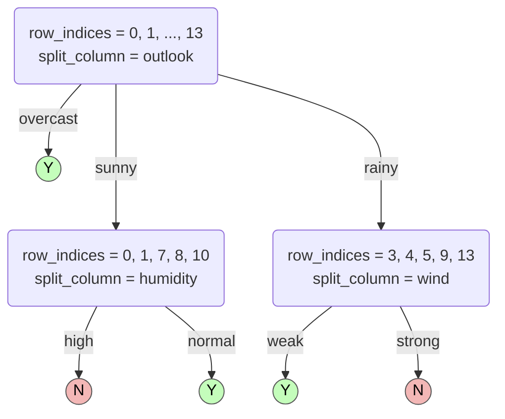

# Decision Tree

Bài này sẽ nói về thuật toán Decision Tree và thực hành nó trên Python.

Đọc bài gốc ở bài viết trên forum [Machine Learning cơ bản](https://machinelearningcoban.com/2018/01/14/id3/).

## Bài toán

Từ một bảng dữ liệu, ta sẽ xây dựng một Decision Tree để dự đoán nhãn của một điểm dữ liệu mới khi biết các thuộc tính của điểm dữ liệu đó.

??? example "Thực hành"
    Cho một bảng dữ liệu ghi chép lại dữ liệu thời tiết của 14 ngày, cùng với đó là việc một đội bóng có quyết định đi chơi bóng hay không:

    ??? quote "Bảng dữ liệu `weather.csv`"
        | id |  outlook | temperature | humidity |  wind  | play |
        |:--:|:--------:|:-----------:|:--------:|:------:|:----:|
        |  1 |   sunny  |     hot     |   high   |  weak  |  no  |
        |  2 |   sunny  |     hot     |   high   | strong |  no  |
        |  3 | overcast |     hot     |   high   |  weak  |  yes |
        |  4 |   rainy  |     mild    |   high   |  weak  |  yes |
        |  5 |   rainy  |     cool    |  normal  |  weak  |  yes |
        |  6 |   rainy  |     cool    |  normal  | strong |  no  |
        |  7 | overcast |     cool    |  normal  | strong |  yes |
        |  8 |   sunny  |     mild    |   high   |  weak  |  no  |
        |  9 |   sunny  |     cool    |  normal  |  weak  |  yes |
        | 10 |   rainy  |     mild    |  normal  |  weak  |  yes |
        | 11 |   sunny  |     mild    |  normal  | strong |  yes |
        | 12 | overcast |     mild    |   high   | strong |  yes |
        | 13 | overcast |     hot     |  normal  |  weak  |  yes |
        | 14 |   rainy  |     mild    |   high   | strong |  no  |

    Từ bảng dữ liệu này, ta sẽ xây dựng một mô hình Decision Tree để dự đoán đội bóng này có đi chơi bóng hay không nếu biết dữ liệu thời tiết của ngày hôm đó. Nói cách khác, ta cần dự đoán giá trị của _play_ khi biết giá trị của 4 thuộc tính là _outlook_, _temperature_, _humidity_, _wind_.

## Xây dựng Decision Tree

Đầu tiên, với bảng dữ liệu ban đầu, ta cần tìm một thuộc tính để chia dữ liệu thành các nhóm khác nhau, mỗi nhóm tương ứng với một giá trị của thuộc tính đó.

??? example "Thực hành"
    Đối với bài toán cụ thể nói trên, ta cần tìm một trong số 4 thuộc tính là _outlook_, _temperature_, _humidity_, _wind_ để chia dữ liệu thành các nhóm khác nhau, mỗi nhóm tương ứng với một giá trị của thuộc tính đó.

Vậy trong các thuộc tính của một bảng dữ liệu, làm sao để biết ta nên chia theo thuộc tính nào?

Câu trả lời là ta sẽ đi tính _information gain_ của từng thuộc tính, sau đó chọn ra thuộc tính có _information gain_ lớn nhất rồi chia theo thuộc tính đó.

Công thức tính _information gain_ của một thuộc tính $x$ trong bảng dữ liệu $\mathcal{S}$ như sau:

$$
\tag{1}
G(x, \mathcal{S}) = H(\mathcal{S}) - H(x, \mathcal{S})
$$

trong đó:

-   $H(\mathcal{S})$ là _entropy_ của bảng dữ liệu $\mathcal{S}$
-   $H(x, \mathcal{S})$ là _weighted entropy_ của bảng dữ liệu $\mathcal{S}$ sau khi được chia theo thuộc tính $x$

Vậy thì 2 cái này được tính như thế nào?

### Entropy

Cho bảng dữ liệu $\mathcal{S}$, _entropy_ của nó được tính như sau:

$$
\tag{2}
H(\mathcal{S}) = - \sum_{c \in \mathbf{C}} \dfrac{N_c}{N} \log_2 \left( \dfrac{N_c}{N} \right)
$$

trong đó:

-   $\mathbf{C}$ là tập các class của bài toán
-   $N_c$ là số điểm dữ liệu thuộc class $c$ trong bảng dữ liệu $\mathcal{S}$
-   $N$ là tổng số điểm dữ liệu trong bảng dữ liệu $\mathcal{S}$

!!! warning "Lưu ý"

    - Phép $\log$ là lấy theo cơ số $2$.
    - Quy ước: $0 \log 0 = 0$

??? example "Thực hành"

    Với bảng dữ liệu đã cho, ta có:

    - $\mathbf{C} = \left\{ \texttt{yes}, \texttt{no} \right\}$
    - $N = 14$
    - $N_{\texttt{yes}} = 9$; $N_{\texttt{no}} = 5$

    Do đó, ta tính được $H(\mathcal{S})$:

    $$
    H(\mathcal{S}) = - \frac{5}{14}\log\left(\frac{5}{14}\right) - \frac{9}{14}\log\left(\frac{9}{14}\right)
    \approx 0.9403
    $$

### Weighted Entropy

Cho bảng dữ liệu $\mathcal{S}$ và một thuộc tính $x$, _weighted entropy_ của $\mathcal{S}$ khi chia theo thuộc tính $x$ như sau:

$$
\tag{3}
H(x, \mathcal{S}) = \sum_{k \in K} \frac{m_k}{N} H(\mathcal{S}_k)
$$

trong đó:

-   $K$ là tập các giá trị của thuộc tính $x$
-   $N$ là tổng số điểm dữ liệu trong bảng dữ liệu $\mathcal{S}$
-   $\mathcal{S}_k$ là bảng dữ liệu mới thu được khi chỉ lấy các điểm dữ liệu có $x = k$
-   $m_k$ là tổng số điểm dữ liệu có $x = k$. Nói cách khác, $m_k$ là tổng số điểm dữ liệu của $\mathcal{S}_k$

??? example "Thực hành"

    Với bảng dữ liệu ban đầu, xét thuộc tính _outlook_, có 3 giá trị là _sunny_, _overcast_, _rainy_. Tương ứng ta có 3 bảng dữ liệu mới là $\mathcal{S}_s$, $\mathcal{S}_o$, $\mathcal{S}_r$:

    === "$\mathcal{S}_s$"

        | id |  outlook | temperature | humidity |  wind  | play |
        |:--:|:--------:|:-----------:|:--------:|:------:|:----:|
        |  1 |   sunny  |     hot     |   high   |  weak  |  no  |
        |  2 |   sunny  |     hot     |   high   | strong |  no  |
        |  8 |   sunny  |     mild    |   high   |  weak  |  no  |
        |  9 |   sunny  |     cool    |  normal  |  weak  |  yes |
        | 11 |   sunny  |     mild    |  normal  | strong |  yes |

    === "$\mathcal{S}_o$"

        | id |  outlook | temperature | humidity |  wind  | play |
        |:--:|:--------:|:-----------:|:--------:|:------:|:----:|
        |  3 | overcast |     hot     |   high   |  weak  |  yes |
        |  7 | overcast |     cool    |  normal  | strong |  yes |
        | 12 | overcast |     mild    |   high   | strong |  yes |
        | 13 | overcast |     hot     |  normal  |  weak  |  yes |

    === "$\mathcal{S}_r$"

        | id | outlook | temperature | humidity |  wind  | play |
        |:--:|:-------:|:-----------:|:--------:|:------:|:----:|
        |  4 |  rainy  |     mild    |   high   |  weak  |  yes |
        |  5 |  rainy  |     cool    |  normal  |  weak  |  yes |
        |  6 |  rainy  |     cool    |  normal  | strong |  no  |
        | 10 |  rainy  |     mild    |  normal  |  weak  |  yes |
        | 14 |  rainy  |     mild    |   high   | strong |  no  |

    Số điểm dữ liệu của 3 bảng dữ liệu này lần lượt là: $m_s = 5$, $m_o = 4$, $m_r = 5$.

    Ta tính được _entropy_ của 3 bảng dữ liệu này như sau:

    $$
    \begin{eqnarray}
        H(\mathcal{S}_s) &=&-\frac{3}{5}\log\left(\frac{3}{5}\right) - \frac{2}{5}\log\left(\frac{2}{5}\right) \approx 0.9710 \\
        H(\mathcal{S}_o) &=&-\frac{0}{4}\log\left(\frac{0}{4}\right) - \frac{4}{4}\log\left(\frac{4}{4}\right) = 0\\
        H(\mathcal{S}_r) &=& -\frac{2}{5}\log\left(\frac{2}{5}\right) - \frac{3}{5}\log\left(\frac{3}{5}\right) \approx 0.9710
    \end{eqnarray}
    $$

    Từ đó ta tính được _weighted entropy_ của $\mathcal{S}$ khi chia theo thuộc tính _outlook_ như sau:

    $$
        H({outlook}, \mathcal{S}) = \frac{5}{14}H(\mathcal{S}_s) + \frac{4}{14}H(\mathcal{S}_o) + \frac{5}{14}H(\mathcal{S}_r) \approx 0.6935
    $$

    Tương tự, ta có thể tính được _weighted entropy_ cho các thuộc tính còn lại:

    $$
    H({temperature, \mathcal{S}}) \approx 0.9111, \quad H(humidity, \mathcal{S}) \approx 0.7885, \quad H(wind, \mathcal{S}) \approx 0.8922
    $$

### Information Gain

Sau khi tính được _entropy_ của bảng dữ liệu và _weighted entropy_ của từng thuộc tính, ta tính _information gain_ của từng thuộc tính theo công thức $(1)$. Chọn ra thuộc tính có _information gain_ lớn nhất và chia bảng dữ liệu theo thuộc tính đó để được các bảng dữ liệu mới nhỏ hơn.

Dễ thấy thuộc tính có _information gain_ lớn nhất thì chính là thuộc tính có _weighted entropy_ nhỏ nhất.

Ở đây bảng dữ liệu ban đầu tương ứng với một node của Decision Tree, các bảng dữ liệu con tương ứng với các node con của node đó.

Với mỗi bảng dữ liệu tương ứng với các node con, ta tiếp tục khi nó thành các dữ liệu nhỏ hơn cho đến khi bảng dữ liệu thu được chỉ có đúng 1 class (node lá), hay bảng dữ liệu thu được có _entropy_ bằng $0$

??? example "Thực hành"

    Với bảng dữ liệu ban đầu, ta thấy _outlook_ là thuộc tính có _weighted entropy_ nhỏ nhất, như vậy ta sẽ chọn thuộc tính này đầu tiên cho Decision Tree.

    Bắt đầu với bảng dữ liệu ban đầu tương ứng với root node, ta được 3 bảng dữ liệu con tương ứng với 3 node con.

    Tiếp tục thực hiện các bước trên ở các bảng dữ liệu con cho đến khi thu được bảng dữ liệu có _entropy_ bằng 0, ta được hình dạng của Decision Tree cho bài toán này như sau[^1]:

    <figure markdown="span">
        { width="70%" }
    </figure>

### Điều kiện dừng

Trong thuật toán trên, ta liên tục chia các node cho đến khi được node lá. Kết quả cuối cùng sẽ thu được một tree mà mọi điểm trong tập train đều được dự đoán đúng. Lúc này tree sẽ rất phức tạp, nhiều node lá chỉ có một vài điểm dữ liệu. Như vậy, tình trạng overfitting rất dễ xảy ra.

Để tránh tình trạng trên, có một số phương pháp để kiểm tra điều kiện dừng. Nếu một trong số các điều kiện này xảy ra, ta sẽ không tiếp tục phân chia node đó và coi nó là một node lá:

-   Nếu node đó có _entropy_ bằng 0, tức mọi điểm trong node đều thuộc một class
-   Nếu node đó có số phần tử nhỏ hơn một ngưỡng nào đó
-   Nếu khoảng cách từ node đó đến root node đạt tới một giá trị nào đó
-   Nếu tổng số node lá vượt qua một ngưỡng nào đó
-   Nếu việc phân chia node đó không làm giảm _entropy_ quá nhiều (_information gain_ nhỏ hơn một ngưỡng nào đó)

Khi sử dụng các phương pháp trên, ta chấp nhận việc có một số điểm trong tập train bị phân lớp sai để tránh overfitting.

Ngoài các phương pháp trên, một phương pháp phổ biến khác được sử dụng để tránh overfitting là _pruning_.

## Pruning

!!! note

    Phần này chỉ trình bày ý tưởng của phương pháp pruning chứ không đi vào chi tiết.

Ý tưởng chung của phương pháp pruning là đầu tiên, xây dựng một decision tree trong đó mọi điểm trong tập train đều được phân lớp đúng. Sau đó, các node lá có chung một node cha sẽ được cắt tỉa và node cha đó sẽ trở thành một node lá.

Một số cách để pruning như sau:

1. Trước tiên dataset được chia thành một tập train và tập validation. Decision tree được xây dựng trên tập train cho tới khi mọi điểm trong tập train đều được phân lớp đúng. Sau đó đi ngược từ các node lá, cắt tỉa các node anh em của nó (các node có cùng node cha) nếu như độ chính xác trên tập validation được cải thiện. Khi nào độ chính xác trên tập validation không cải thiện được nữa thì dừng lại.

2. Sử dụng toàn bộ tập train để xây dựng decision tree. Giả sử decision tree cuối cùng có $K$ node lá, tập hợp các điểm dữ liệu ở mỗi node lá lần lượt là $\mathcal{S}_1, \dots,
\mathcal{S}_K$, ta định nghĩa hàm loss sau:
   $$
    \tag{4}
    \mathcal{L} = \sum_{k = 1}^K \frac{|\mathcal{S}_k|}{|\mathcal{S}|} H(\mathcal{S}_k) + \lambda K, \quad \lambda \in \mathbb{R}^+
    $$ Đây chính là kỹ thuật regularization. Giá trị của hàm số này nhỏ nếu cả data loss (số hạng thứ nhất) nhỏ (entropy tại mỗi node là thấp) và regularization (số hạng thứ hai) cũng nhỏ (số node lá ít). Trước hết, xây dựng một decision tree mà mọi điểm trong tập train đều được phân loại đúng (toàn bộ các entopy của các node bằng 0). Lúc này data loss bằng $0$ nhưng regularization có thể lớn, khiến cho $\mathcal{L}$ lớn. Sau đó, ta tỉa dần các node lá sao cho $\mathcal{L}$ giảm. Việc cắt tỉa được lặp lại đến khi $\mathcal{L}$ không thể giảm được nữa.


## Code

Download dữ liệu `weather.csv` tại [đây]().

Đầu tiên ta import các thư viện cần thiết:

```py linenums="1"
import pandas as pd
import numpy as np
```

Load dữ liệu:

```py linenums="1"
df = pd.read_csv("weather.csv")
print(df)
```

```
    id   outlook temperature humidity    wind play
0    1     sunny         hot     high    weak   no
1    2     sunny         hot     high  strong   no
2    3  overcast         hot     high    weak  yes
3    4     rainy        mild     high    weak  yes
4    5     rainy        cool   normal    weak  yes
5    6     rainy        cool   normal  strong   no
6    7  overcast        cool   normal  strong  yes
7    8     sunny        mild     high    weak   no
8    9     sunny        cool   normal    weak  yes
9   10     rainy        mild   normal    weak  yes
10  11     sunny        mild   normal  strong  yes
11  12  overcast        mild     high  strong  yes
12  13  overcast         hot   normal    weak  yes
13  14     rainy        mild     high  strong   no
```

Viết hàm tính _entropy_ của một bảng dữ liệu: (1)
{ .annotate }

1.  Nhắc lại: $$ \tag{2}
    H(\mathcal{S}) = - \sum\_{c \in \mathbf{C}} \dfrac{N_c}{N} \log_2 \left( \dfrac{N_c}{N} \right)
    $$

```py linenums="1"
def entropy(data: pd.DataFrame):
    y = data.iloc[:, -1]  # Retrieve the labels
    value_counts = y.value_counts()  # Calculate all N_c
    probs = value_counts / len(y)  # Calculate all N_c / N
    entropy = -np.sum(probs * np.log2(probs))  # Calculate the entropy
    return entropy
```

Viết hàm tính _weighted entropy_ của một bảng dữ liệu và một thuộc tính: (1)
{ .annotate }

1.  Nhắc lại: $$ \tag{3}
    H(x, \mathcal{S}) = \sum\_{k \in K} \frac{m_k}{N} H(\mathcal{S}\_k)
    $$

```py linenums="1"
def weighted_entropy(data: pd.DataFrame, prop: str):
    N = len(data)
    weighted_entropy = 0

    for value in data[prop].unique():
        subset = data[data[prop] == value]  # Calculate m_k
        value_entropy = entropy(subset)  # Calculate H(S_k)

        weighted_entropy += value_entropy * len(subset) / N  # Add to the final result

    return weighted_entropy
```

Ta có thể thử chạy hàm `weighted_entropy` trên bảng dữ liệu ban đầu xem kết quả đã đúng chưa:

```py linenums="1"
for col in ["outlook", "temperature", "humidity", "wind"]:
    print(col, weighted_entropy(df, col))
```
```
outlook 0.6935361388961919
temperature 0.9110633930116763
humidity 0.7884504573082896
wind 0.8921589282623617
```
Ta thấy nó khớp với kết quả ta đã tính phía trên. Như vậy có vẻ hàm `entropy` và `weighted_entropy` đã ổn.

Giờ ta sẽ triển khai decision tree. Đầu tiên, ta viết class `TreeNode` như sau:
```py linenums="1"
class TreeNode:
    def __init__(self, row_indices: List[int]) -> None:
        self.row_indices = row_indices  # Indices of data points of the node 
        self.split_column = None  # Property to split the data
        self.children = {}  # A dictionary of <column value> : <child node>
        self.label = None

    def add(self, child_node, column_value):
        self.children[column_value] = child_node

    def __str__(self) -> str:
        return str(self.row_indices)
```
Và class `DecisionTree`:
```py linenums="1"
class DecisionTree:
    def __init__(self) -> None:
        self.root = None  # to store the root TreeNode
        self.leaves = []  # to store leaf nodes
```

Với hàm training cho Decision Tree, ta sử dụng thuật toán BFS để duyệt cây (code hơi dài nhưng có coment đầy đủ)
```py linenums="1"
    def fit(self, data):
        # Initialize the root node with all row indices from the dataset
        self.root = TreeNode(list(range(len(data))))

        # Exclude the label column from the features
        X = data.iloc[:, :-1]

        # Initialize the queue for BFS
        queue = deque([self.root])

        # Perform BFS to build the decision tree
        while queue:
            # Retrieve the current node from the queue
            node = queue.popleft()

            # Get the subset of data corresponding to the current node
            node_data = data.iloc[node.row_indices]

            # Check if the current node is a leaf node
            if entropy(node_data) < 1e-6:
                node.label = node_data.iloc[:, -1].mode()[0]  # Assign the most frequent label to the leaf node
                self.leaves.append(node)  # Add the leaf node to the list of leaves
                continue  # Stop further splitting for this node

            # Find the feature with the minimum entropy for splitting
            node.split_column = min(X.columns, key=lambda col: weighted_entropy(node_data, col))

            # Group the data indices by the selected split column.
            # Note: 'splits' contains indices relative to 'node_data', not the original data.
            splits = node_data.groupby(node_data[node.split_column]).indices

            # Convert grouped indices back to the original data indices
            for val in splits:
                splits[val] = [node.row_indices[ind] for ind in splits[val]]

            # Create child nodes for each group and add them to the current node
            for value in splits:
                indices = splits[value]
                child_node = TreeNode(indices)
                node.add(child_node, value)
                queue.append(child_node)  # Add the child node to the queue for further processing
```
Cuối cùng là hàm predict. Với một bảng dữ liệu mới, ta sẽ duyệt từng hàng của bảng dữ liệu, đưa vào decision tree vừa xây dựng để predict cho từng hàng.
```py linenums="1"
    def predict(self, new_data):
        npoints = new_data.count()[0]  # Retrieve the number of data points in new_data
        labels = [None] * npoints  # Initialize the list to store prediction results

        for n in range(npoints):
            x = new_data.iloc[n, :]  # Get the current data point
            node = self.root  # Start prediction from the root node

            # Traverse the tree until a leaf node is reached
            while node.children:
                col_to_split = node.split_column  # Get the column used for splitting at this node
                if x[col_to_split] not in node.children:  # Check if the split value exists in the children of the current node
                    break  # If the value is not found, this data point cannot be classified

                # Move to the corresponding child node based on the split value
                node = node.children[x[col_to_split]]

            # Assign the label of the reached leaf node to the current data point
            labels[n] = node.label

        return labels
```
Như vậy là ta đã code xong decision tree. Giờ ta sẽ chạy thử trên chính tập dữ liệu đã cho để xem tất cả các điểm dữ liệu đã được phân loại đúng hay chưa.
```py linenums="1"
if __name__ == "__main__":
    df = pd.read_csv("weather.csv")
    X = df.iloc[:, 1:]
    y = df.iloc[:, -1]

    dt = DecisionTree()
    dt.fit(X)

    print(dt.predict(X))
    print(y.to_list())
```
```
['no', 'no', 'yes', 'yes', 'yes', 'no', 'yes', 'no', 'yes', 'yes', 'yes', 'yes', 'yes', 'no']
['no', 'no', 'yes', 'yes', 'yes', 'no', 'yes', 'no', 'yes', 'yes', 'yes', 'yes', 'yes', 'no']
```
Kết quả phân loại của decision tree trùng khớp hoàn toàn với label ban đầu của data, như vậy là ta đã cài đặt thành công decision tree.

Ta có thể vẽ lại decision tree ta vừa xây dựng như sau:


??? code "Code hoàn chỉnh `decision_tree.py`"

    ```py linenums="1" title="decision_tree.py"
    from typing import List
    import pandas as pd
    import numpy as np
    from collections import deque


    def entropy(data: pd.DataFrame):
        y = data.iloc[:, -1]  # Retrieve the labels
        value_counts = y.value_counts()  # Calculate all N_c
        probs = value_counts / len(y)  # Calculate all N_c / N
        entropy = -np.sum(probs * np.log2(probs))  # Calculate the entropy
        return entropy


    def weighted_entropy(data: pd.DataFrame, prop: str):
        N = len(data)
        weighted_entropy = 0

        for value in data[prop].unique():
            subset = data[data[prop] == value]  # Calculate m_k
            value_entropy = entropy(subset)  # Calculate H(S_k)

            weighted_entropy += value_entropy * len(subset) / N  # Add to the final result

        return weighted_entropy


    class TreeNode:
        def __init__(self, row_indices) -> None:
            self.row_indices = row_indices
            self.split_column = None
            self.children = {}
            self.label = None

        def add(self, child_node, column_value):
            self.children[column_value] = child_node

        def __str__(self) -> str:
            return str(self.row_indices)


    class DecisionTree:
        def __init__(self) -> None:
            self.root = None  # The root node of the decision tree
            self.leaves = []  # List to store all the leaf nodes

        def fit(self, data):
            # Initialize the root node with all row indices from the dataset
            self.root = TreeNode(list(range(len(data))))

            # Exclude the label column from the features
            X = data.iloc[:, :-1]

            # Initialize the queue for BFS
            queue = deque([self.root])

            # Perform BFS to build the decision tree
            while queue:
                # Retrieve the current node from the queue
                node = queue.popleft()

                # Get the subset of data corresponding to the current node
                node_data = data.iloc[node.row_indices]

                # Check if the current node is a leaf node
                if entropy(node_data) < 1e-6:
                    node.label = node_data.iloc[:, -1].mode()[0]  # Assign the most frequent label to the leaf node
                    self.leaves.append(node)  # Add the leaf node to the list of leaves
                    continue  # Stop further splitting for this node

                # Find the feature with the minimum entropy for splitting
                node.split_column = min(X.columns, key=lambda col: weighted_entropy(node_data, col))

                # Group the data indices by the selected split column.
                # Note: 'splits' contains indices relative to 'node_data', not the original data.
                splits = node_data.groupby(node_data[node.split_column]).indices

                # Convert grouped indices back to the original data indices
                for val in splits:
                    splits[val] = [node.row_indices[ind] for ind in splits[val]]

                # Create child nodes for each group and add them to the current node
                for value in splits:
                    indices = splits[value]
                    child_node = TreeNode(indices)
                    node.add(child_node, value)
                    queue.append(child_node)  # Add the child node to the queue for further processing

        def predict(self, new_data):
            npoints = new_data.count()[0]  # Retrieve the number of data points in new_data
            labels = [None] * npoints  # Initialize the list to store prediction results

            for n in range(npoints):
                x = new_data.iloc[n, :]  # Get the current data point
                node = self.root  # Start prediction from the root node

                # Traverse the tree until a leaf node is reached
                while node.children:
                    col_to_split = node.split_column  # Get the column used for splitting at this node
                    if x[col_to_split] not in node.children:  # Check if the split value exists in the children of the current node
                        break  # If the value is not found, this data point cannot be classified

                    # Move to the corresponding child node based on the split value
                    node = node.children[x[col_to_split]]

                # Assign the label of the reached leaf node to the current data point
                labels[n] = node.label

            return labels


    if __name__ == "__main__":
        df = pd.read_csv("weather.csv")
        X = df.iloc[:, 1:]
        y = df.iloc[:, -1]

        dt = DecisionTree()
        dt.fit(X)

        print(dt.predict(X))
        print(y.to_list())

    ```
<!-- end -->

[^1]: https://machinelearningcoban.com/2018/01/14/id3/