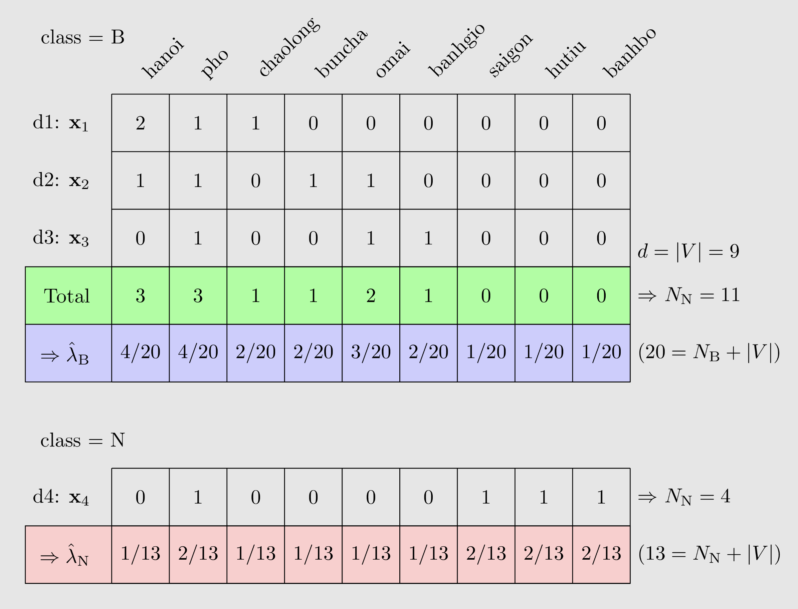

# Naive Bayes Classifier

Bài này sẽ nói về thuật toán Decision Tree và thực hành nó trên Python.

Đọc bài gốc ở bài viết trên forum [Machine Learning cơ bản](https://machinelearningcoban.com/2018/01/14/id3/).

## Bài toán

Xét bài toán classification với $C$ classes $1, 2, \dots, C$. Giả sử có một điểm dữ liệu $\mathbf{x} \in \mathbb{R}^d$, hãy tính xác suất để điểm dữ liệu này rơi vào class $c$:

$$ \tag{1} p(c|\mathbf{x}) $$

Để phân lớp một điểm dữ liệu, ta tính xác suất để điểm dữ liệu đó rơi vào mỗi class và chọn ra class có xác suất cao nhất.

$$ \tag{2}
c = \arg\max_{c \in \{1, \dots, C\}} p(c | \mathbf{x})
$$

Áp dụng quy tắc Bayes:

$$ \tag{3}
c = \arg\max_c p(c | \mathbf{x}) = \arg\max_c \dfrac{p(\mathbf{x} | c) p(c)}{p(\mathbf{x})}
$$

Do mẫu số $p(\mathbf{x})$ không phụ thuộc vào $c$:

$$ \tag{4}
c = \arg\max_c p(\mathbf{x} | c) p(c)
$$

trong đó:

- $p(c)$: xác suất để một điểm rơi vào class $c$
- $p(\mathbf{x} | c)$: phân phối của điểm dữ liệu $\mathbf{x}$ trong class $c$

Để dễ tính $p(\mathbf{x} | c)$, ta thường giả thiết rằng các thành phần của $\mathbb{x}$ là độc lập với nhau:

$$ \tag{5}
p(\mathbf{x} | c) = p(x_1, x_2, \dots, x_d | c) =  \prod_{i = 1}^d p(x_i | c)
$$

!!! note

    Giả thiết các chiều của dữ liệu độc lập với nhau, nếu biết $c$, là quá chặt và ít khi tìm được dữ liệu mà các thành phần hoàn toàn độc lập với nhau. Tuy nhiên, giả thiết ngây ngô này lại mang lại những kết quả tốt bất ngờ. Giả thiết về sự độc lập của các chiều dữ liệu này được gọi là _Naive Bayes_. Cách xác định class của dữ liệu dựa trên giả thiết này có tên là _Naive Bayes Classifier (NBC)_.[^1]

Với một điểm dữ liệu mới $\mathbf{x}$, class của nó sẽ được xác định bởi:

$$ \tag{6}
c = \arg\max_{c \in \{1, \dots, C\}} p(c) \prod_{i=1}^d p(x_i | c)
$$

Khi $d$ lớn và các xác suất $p(x_i | c)$ nhỏ, vế phải của $(6)$ sẽ là một số rất nhỏ, khi tính toán có thể gặp sai số. Để khắc phục, ta lấy $\log$ vế phải của $(6)$. Việc này không ảnh hưởng đến kết quả vì $\log$ là một hàm đồng biến trên tập các số dương.

$$ \tag{7}
c = \arg\max_{c \in \{1, \dots, C\}} \left( \log(p(c)) + \sum_{i=1}^d \log(p(x_i | c)) \right)
$$

## Các phân phối thường dùng cho $p(x_i | c)$

!!! warning "Lưu ý"
    $$\displaystyle \sum_{i = 1}^d p(x_i | c) = 1, \quad \forall c$$

### Gaussian Naive Bayes

Thường được sử dụng cho loại dữ liệu mà các thành phần là các biến liên tục.

$$ \tag{8}
p(x_i|c) =  \dfrac{1}{\sqrt{2\pi \sigma_{ci}^2}} \exp\left(- \dfrac{(x_i - \mu_{ci})^2}{2 \sigma_{ci}^2}\right)
$$

### Multinomial Naive Bayes

Thường được sử dụng cho loại dữ liệu mà features vector được tính bằng Bags of Words.

$$ \tag{9}
p(x_i | c) = \dfrac{N_{ci}}{N_c}
$$

trong đó:

- $N_{ci}$: tổng số lượng word $x_i$ trong class $c$h
- $N_c$: tổng số lượng word của class $c$

Cách tính này có một vấn đề: nếu từ $x_i$ chưa bao giờ xuất hiện trong class $c$ thì biểu thức $(10)$ sẽ bằng $0$, dẫn đến vế phải của $(6)$ bằng $0$ bất kể các giá trị khác có lớn thế nào.

Để khắc phục, một kỹ thuật được gọi là _Laplace smoothing_ được áp dụng:

$$ \tag{10}
p(x_i | c) = \dfrac{N_{ci} + \alpha}{N_{c} + d\alpha}, \quad \alpha > 0
$$

Thường thì ta lấy $\alpha = 1$.

!!! note

    Có thể hình dung phương pháp này là với mỗi class $c$, với mỗi từ $x_i$, ta đều thêm sẵn một số lượng $\alpha$ từ $x_i$.

<!-- end -->

### Bernoulli Naive Bayes

Thường được sử dụng cho loại dữ liệu mà mỗi thành phần là một giá trị binary.

$$ \tag{11}
p\left(x_i | c\right) = p\left(i | c\right)^{x_i} \left(1 - p\left(i | c\right)\right) ^{1 - x_i}
$$

trong đó $p\left(x_i | c\right)$ có thể được hiểu là xác suất từ thứ $i$ xuất hiện trong các văn bản của class $c$.

## Thực hành

Phần này ta sẽ xây dựng các bước để giải một bài toán Navie Bayes Classifier sử dụng các kiến thức ở trên.

???+ example "Ví dụ: **Bắc hay Nam**"

    Ta sẽ thực hành trên bài toán sau: Cho các văn bản $\text{d1}$, $\text{d2}$, $\text{d3}$, $\text{d4}$ như trong bảng dưới đây. Mỗi văn bản này thuộc vào 1 trong 2 classes: $\text{B}$ (Bắc) hoặc $\text{N}$ (Nam). Hãy xác định class của văn bản $\text{d5}$.

    |               | Document      | Content                           | Class      |
    |:-------------:|:-------------:|-----------------------------------|:----------:|
    | **Training**  | $\text{d1}$   | $\text{hanoi pho chaolong hanoi}$ | $\text{B}$ |
    |               | $\text{d2}$   | $\text{hanoi buncha pho omai}$    | $\text{B}$ |
    |               | $\text{d3}$   | $\text{pho bahngio omai}$         | $\text{B}$ |
    |               | $\text{d4}$   | $\text{saigon hutiu banhbo pho}$  | $\text{N}$ |
    | **Test**      | $\text{d5}$   | $\text{hanoi hanoi buncha hutiu}$ | $\text{?}$ |

### Training

- Bước 1: Tính các $p(c)$

    ???+ example "Ví dụ: **Bắc hay Nam**"
        Ví dụ ta đang xét có 2 class là $\text{B}$ và $\text{N}$. Ta sẽ tính các $p(\text{B})$ và $p(\text{N})$:

        $$
        p(\text{B}) = \dfrac{3}{4}, \quad\quad p(\text{N}) = \dfrac{1}{4}
        $$

- Bước 2: Xác định $V = \text{Bags of Words}$, là tập hợp toàn bộ các từ trong văn bản.

    ???+ example "Ví dụ: **Bắc hay Nam**"
        $$
        V = \{\text{hanoi, pho, chaolong, buncha, omai, banhgio, saigon, hutiu, banhbo}\}, \quad \lvert V \rvert = 9
        $$

- Bước 3: Với mỗi word $x_i \in V$, với mỗi class $c$, tính $p(x_i | c)$.
    
    ???+ example "Ví dụ: **Bắc hay Nam**"
        Đầu tiên đếm số từ của mỗi class, ta tính được class $\text{B}$ có tổng cộng $11$ word và class $\text{N}$ có tổng cộng 4 word:
        
        $$
        N_\text{B} = 11, \quad N_\text{N} = 4
        $$

        Xét class $\text{B}$, ví dụ với word $\text{hanoi}$, trong tất cả các văn bản thuộc class $\text{B}$, word $\text{hanoi}$ xuất hiện tổng cộng $3$ lần.

        Áp dụng $(10)$ với $\alpha = 1$, ta tính được:

        $$
        p(\text{hanoi} | \text{B}) = \dfrac{3 + 1}{11 + 9.1} = \dfrac{4}{20}
        $$

        Tương tự với các word còn lại và class $\text{N}$, ta tính được các $p(x_i | c)$ như sau (ký hiệu $\hat{\lambda}$ trong hình chính là $p$):

        

### Test

Với mỗi văn bản mới, ta thực hiện các bước sau:

- Bước 1: Tính điểm dữ liệu $\mathbf{x}$ tương ứng

    ???+ example "Ví dụ: **Bắc hay Nam**"
        Với
        
        $$\text{d5} = \text{hanoi hanoi buncha hutiu}$$
        
        và
        
        $$
        V = \{\text{hanoi, pho, chaolong, buncha, omai, banhgio, saigon, hutiu, banhbo}\}
        $$
        
        ta tính được $\mathbf{x}_5 = \left[ 2, 0, 0, 1, 0, 0, 0, 1, 0 \right]$.

- Bước 2: Xác định class của nó như ở $(6)$

    $$ \tag{6}
    c = \arg\max_{c \in \{1, \dots, C\}} p(c) \prod_{i=1}^d p(x_i | c)
    $$

[^1]: https://machinelearningcoban.com/2017/08/08/nbc/